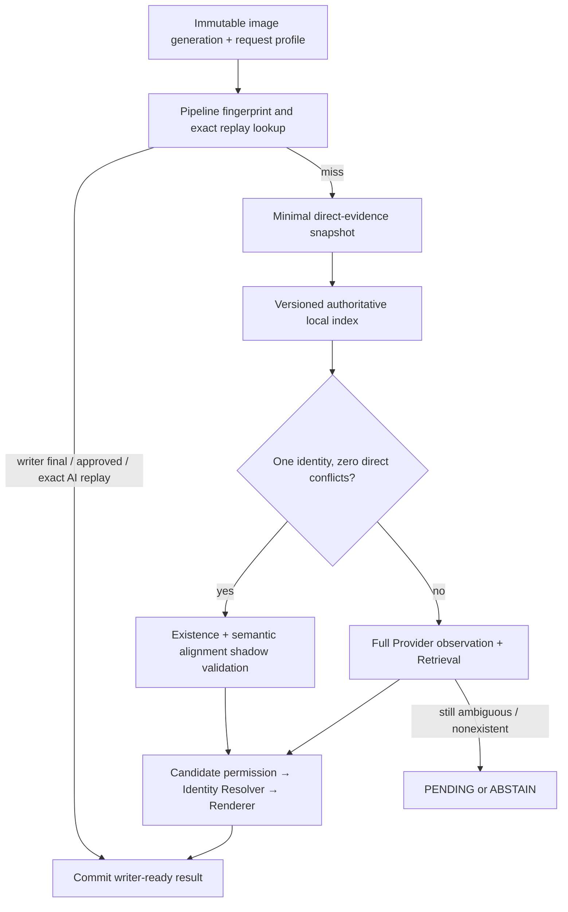

# Target architecture: index-first identity with an explicit abstention boundary

Status: offline specification only. Base: `origin/main@dbc989e1`. No database,
model, queue, deployment or production behaviour was changed while producing
this document.

## Decision first

The opposing conclusion is the higher-confidence one: a universal, complete
SEM title in two to three seconds is not physically compatible with the current
full-provider route. Across the 60 familiar observations, the Provider alone
had p50 20.921 s and p95 36.471 s. The more recent 17 unseen observations reduced
Provider p50 to 5.922 s and p95 to 11.434 s, but even that component alone exceeds
three seconds at p50.

Two to three seconds is therefore a route property, not a tuning target for the
same route:

- exact same-image replay can be a sub-1.5-second target;
- a first image whose printed anchor resolves to one authoritative index row can
  be a sub-3-second target;
- every card without a unique, non-conflicting index identity must continue to
  the full Provider route or return `PENDING / ABSTAIN`, never a guessed final.

The old premise that the Catalog was blocked on year/product on 60/60 was also
wrong. The selected Catalog candidate had no blocked fields on 44/44 selections;
53 of 62 permitted field applications reached final Resolver state across
25/60 observations. The load-bearing problem is not “give the index authority.”
It is “make exact identity reachable, make field adapters lossless, and prove
the index row independently before exercising the authority it already has.”

## Evidence envelope

Every current-runtime count in this specification comes from:

- familiar r1, 20 observations, SHA-256
  `aba5f50adee0f6526a6ca735e47ab034bcd4642dc971d43e465ddcb97dac0a69`;
- familiar r2, 20 observations, SHA-256
  `43de606be02ee6878c40b6ca622ae4142fb30d76ff746317df957c6238c1cea8`;
- familiar r3, 20 observations, SHA-256
  `902c4f855f71e2727ccd812011e55aa8b610dd898e0dab4b26c1ddaf0835aa28`;
- unseen, 17 observations, SHA-256
  `4069bd66aecf7d248571d1d4d811e043b2cd498f840f5c63aac093e23d2254b9`;
- unseen checklist labels, SHA-256
  `796590f61486fbf1bacb344b8bbe8f207a1aba50f1f9099b99e4547edb6001ff`;
- Product schema artifact, 185 product-years and 30,006 set names, SHA-256
  `c12a2726de5c251c3f593400517aece0b9e3c374112826474a30e21f143de13d`.

The 60 familiar observations are 20 identities replayed three times. They can
prove mechanics and repeat stability; they are not 60 independent accuracy
labels. The 17 semantic alignment labels are a calibration set, not a holdout.
Static reachability without a persisted runtime counter is explicitly
`UNCHECKED`.

## The four required properties, corrected

| property | current evidence | current verdict |
| --- | --- | --- |
| The index decides identity when it has a uniquely matching authoritative row | Catalog candidates on 50/60, selected on 44/60, exact-card match on 9/60 (3 distinct identities), and 53 actual applications. But 35/60 selections use a same-source reviewed-memory override; subject agreement is 44/60 while subject application is 0/60. Pre-L2 lookup is 0/60 and 0/17. | Partial authority exists after Provider; index-first identity is not reachable. |
| A card outside the model prior can still be named | Unseen title policy-fair recall is 0.485037 over 17/17 reviewed titles. Catalog raw candidates existed on 10/17 and Vector raw candidates on 16/17, but only 1/17 from each reached its prompt-safe set. | Not achieved. More candidates already exist than the control plane safely admits. |
| A nonexistent identity is not published | Offline semantic labels mark at least one claim as `NONE` on 11/17 unseen cards; the unwired alignment module agrees on 11/11. Online use is 0/17, and all 17 received a title. | Not achieved. There is no online existence/abstention boundary. |
| A writer can receive an answer in two to three seconds | Familiar writer-visible p50/p95 54.202/73.142 s; job-to-L2 p50/p95 168.802/311.038 s under a contended three-round batch. Unseen writer-visible p50/p95 9.172/16.294 s. Exact replay and exact index lookup were exercised 0 times in both cohorts. | Full route is outside the target; fast-route latency is `UNCHECKED`. |

## What must be read from the current image

An authoritative index can supply stable identity fields only after the current
physical card selects one row. The minimum current-image packet is:

1. image content/generation hash and pipeline fingerprint;
2. a direct printed card/checklist/collector code when present;
3. enough direct context to disambiguate duplicate codes: year/season,
   product/set token, and subject token;
4. current-instance fields that an index must never copy: serial numerator,
   grade, cert, condition and defects;
5. current-card parallel/finish evidence whenever neighbouring checklist rows
   differ only by finish.

Everything else may come from one independently sourced Official or Reviewed
row after exact identity is established. “Same product” is not an identity-cache
hit: `buildIdentityResultCacheKey` includes image content plus the pipeline
fingerprint at `lib/listing/cache/identity-result-cache.mjs:162-206`. A second
card from the same box has a different image hash. It can reuse a prefetched
product index, not the first card's terminal title.

## The target control flow

The single-owner boundary remains unchanged:

- Catalog/Vector propose and support;
- Candidate application decides which proposed fields may enter;
- Identity Resolver owns final SEM fields;
- Renderer owns the 80-character title;
- neither an index row nor the alignment module writes a title directly.

The existing immutable stage shell in
`lib/listing/v4/pipeline/native-recognition-stages.mjs:35-132` is the right
orchestration shape. Its exact-identity stage already orders
`WRITER_FINAL_REPLAY → APPROVED_IDENTITY_MEMORY → AI_TERMINAL_L2_REPLAY →
PRE_PROVIDER_RESCAN → FULL_RECOGNITION` at `:75-118`; exact-anchor is currently
shadow output, not a final result.

## Target latency budget

The target numbers below are design budgets, not measured claims. The measured
column is the aggregate of the 60 familiar observations unless stated
otherwise.

| stage | measured full-route p50 / p95 | first image, exact index target | exact same-image replay target | role on critical path |
| --- | ---: | ---: | ---: | --- |
| request, auth, canonical asset references | preparation 3.724 / 6.833 s; all 60/60 used an asset cache, so first upload is `UNCHECKED` | 450 ms | 350 ms | mandatory; no image bytes should be re-uploaded after a verified generation exists |
| fingerprint + terminal replay lookup | bypassed 60/60 and 17/17; hits 0 | parallel, at most 200 ms | 150 ms | mandatory; a Catalog revision attachment failure must fail replay closed |
| minimal code/context crop | pre-ingestion node wait 2–3 ms is only a rendezvous, not OCR execution; true minimal-read duration is `UNCHECKED` | 850 ms | skipped | mandatory only on cache miss; bounded crop, not a full natural-language observation |
| authoritative local index lookup | Catalog 1.277 / 4.510 s after Provider | 250 ms | skipped | mandatory on index route; prefetched per product/batch |
| existence/alignment + direct-conflict validation | module offline only; online 0/77 observations | 50 ms | 100 ms fingerprint/state validation | mandatory safety boundary, no external API |
| Resolver + Renderer | Resolver 0.011 / 0.022 s; Renderer 0.007 / 0.020 s | 50 ms | included in hydration | mandatory and deterministic |
| commit, trace and writer status | observability persistence 0.498 / 2.453 s | 550 ms | 450 ms | mandatory, idempotent |
| response/network reserve | not isolated | 300 ms | included above | explicit redundancy budget |
| **route total** | full-route writer-visible 54.202 / 73.142 s familiar; 9.172 / 16.294 s unseen | **2.450 s target** | **1.050 s target; 1.500 s p95 ceiling** | if the exact gate misses its budget, return pending and continue; do not guess |

For cards after the first card in one product batch, a 2.100-second design
target is possible only by prefetching the local product index while the first
card is being reviewed. That is not a cache hit and remains unmeasured.

The full-provider throughput bound in the familiar cohort is also explicit:
with two slots and p50 20.921 s, the provider-only ceiling is
`2 × 60 / 20.921 = 5.74 cards/minute` before queue, retry and persistence
overhead. A six-card-per-minute sustained target therefore cannot be guaranteed
by the full route at this operating point; it requires some cards to leave via
the exact routes.

## Critical path versus compensating work

| current work | measured | target disposition |
| --- | ---: | --- |
| Evidence Completion | 44/60 familiar terminal paths; p50 33.386 s, p95 42.464 s among those 44 | never on exact index or replay path; retain only in full fallback until an explicit replay proves its marginal value |
| full GPT observation | 60/60 familiar and 17/17 unseen | fallback only when exact identity is not proven |
| vector embedding | p50 3.750 s, p95 4.891 s; overlaps Provider | fallback/selection aid, never required after one exact authoritative row |
| Catalog retrieval | 60/60 and 17/17 queried | move a local exact lookup before Provider; broad search remains fallback |
| post-observation deadline | p50 1.609 s, p95 5.000 s; completed 53/60, partial 7/60 | absent from exact route |
| card-domain reranker | shadow 60/60, would change 12/60, production changes 0/60 | selection shadow only; irrelevant after an exact unique row |
| learned reranker | queued 48/60, failed 12/60, production changes 0/60 | repair execution before judging; never place it on exact route |

Current source does **not** prove that Evidence Completion is disabled in the
writer-assisted profile. `lib/listing/v4/application/recognition-profile-adapter.mjs:10-29,47-50`
hard-codes it true after environment defaults. This is an intentional profile
owner but a dead environment override. A future experiment must use a distinct,
versioned benchmark profile; allowing an environment flag to mutate the
production profile would reintroduce strategy drift.

## Safe implementation order

The load-bearing change is not a faster model. It is making every observed
route and field state truthful before increasing Catalog power.

| order | proposed change and exact boundary | evidence required before it | blast radius | falsification / rollback condition |
| ---: | --- | --- | --- | --- |
| 0 | Preserve serial `null` in `lib/listing/v4/result-adapter.mjs:76-82` and `lib/listing/candidates/candidate-decision-stage.mjs:232-240`; make aliases semantic in `lib/listing/evaluation/evaluation-decision-trace-packet.mjs:235-257`; compute one effective benchmark profile/flag set in `scripts/v4-ebay-smoke.mjs:814-856,5043-5051`. | Offline fixtures distinguish true, false and null; report profile equals every row's effective profile. | serial presentation and evaluation truth; no Retrieval authority change | any explicit false starts printing a numerator; any existing verified numerator disappears; report/runtime profile differs |
| 1 | Define a versioned adapter in new `lib/listing/catalog/product-schema-runtime-adapter.mjs`, with `scripts/build-product-schemas.mjs:64-108` as its producer; do not pass the raw file directly. Expose set ownership separately from checklist codes, card types and parallel records. | 185/185 schema rows validate; unsupported consumer fields remain absent, never synthesized. | offline schema and shadow trace only | adapter invents a code/type/parallel not present in source; schema validation is not 100% |
| 2 | Build a read-only evaluator in new `lib/listing/catalog/product-schema-shadow-evaluator.mjs`, invoked beside the 6/6 gate boundaries in `lib/listing/v4/pipeline/native-recognition-core.mjs:1772-1775,1894-1897,2703-2706,2756-2759,4363-4375,5394-5397`. Persist schema/registry counts and rejection reasons, but do not feed its result into the production gate. Leave the 2/2 empty convergence branches at `lib/listing/orchestration/identity-convergence-retriever.mjs:43-50,68-73` inert while candidate application is the single owner. | Stage trace coverage at least 99%; every shadow rejection records the exact source row and rule. | constraint shadow only; no title or candidate change | any independently correct candidate would be filtered; source/version missing; shadow changes a production field |
| 3 | Feed direct pre-ingestion patches into `lib/listing/v4/anchors/anchor-extractor.mjs:110-202` before routing at `lib/listing/v4/anchors/anchor-router.mjs:22-58`; retain the lookup as shadow in `lib/listing/v4/anchors/pre-l2-anchor-probe.mjs:17-60`. | Direct evidence provenance, crop and normalization version persisted; route is nonzero on development without false anchors. | pre-L2 lookup load and trace; still no provider skip | anchor derives from a non-direct hint; one false exact code; p95 exceeds its 850 ms budget |
| 4 | Build a versioned local relation in new `lib/listing/catalog/authoritative-identity-index.mjs` from the adapter, including `data/catalog/product-schemas.json` set ownership. Record Top-1 identity, duplicate count and direct conflicts beside the shadow probe; do not alter Selection. | Independent exact identity labels, not the same card's Catalog row or parsed system output; Recall@1/5/20 and false-filter counts. | read-only Catalog shadow | critical false candidate filter >0; correct identity missing while raw row exists; index revision absent |
| 5 | Keep `lib/listing/catalog/entity-alignment.mjs` unwired until an independently labelled validation cohort exists; then add trace-only shadow evaluation. | Unseen calibration: TP 11, FP 0, FN 0, TN 6. Familiar has 59/60 checked comparisons but 0/60 independent NONE labels, so its error metrics are `UNCHECKED`. Independent Validation must have false-NONE 0. | existence/alignment diagnostics only | any false `NONE`; candidate coverage absent but status is not `UNCHECKED`; tie selects one value |
| 6 | Fail exact replay closed if `attachActiveCatalogSnapshotRevision` fails at `lib/listing/v4/pipeline/native-recognition-core.mjs:6632-6640`, rather than accepting the deployment fallback in `lib/listing/cache/identity-cache-version-contract.mjs:87-97`. | Exact replay benchmark: first call 1 Provider, second 0, byte-identical title/Resolver state; revision mismatch calls Provider. | cache hit rate and latency, not cold algorithm | stale result replays across Catalog revision; writer-final loses priority; missing revision still returns AI cache |
| 7 | Assemble the complete exact-route eligibility result in shadow at the real injection boundary, `lib/listing/v4/pipeline/native-recognition-core.mjs:6652-6674`, using the stage contract at `lib/listing/v4/pipeline/native-recognition-stages.mjs:75-118`, local index, direct conflicts and alignment. Always call Provider and persist `would_be_eligible`; do not return the shadow result. | Independently labelled Validation shows unique Official/Reviewed row, direct code/context, zero conflicts, no alignment false-NONE, and deterministic Resolver/Renderer parity. | shadow computation and trace only; Provider calls unchanged | any shadow result changes a title, skips Provider, copies an instance field, or marks a wrong identity eligible |
| 8 | Bridge Catalog `subjects` to candidate `players` before `lib/listing/evidence/evidence-schema.mjs:540-545`; retain all permission and Resolver gates. | Independent subject labels on selected Catalog rows; safe application precision 100%. | subject support/application only | one neighbouring-card subject overwrites the current card; critical entity regression >0 |
| 9 | Promote the already-proven exact eligibility from shadow to a returned result at `lib/listing/v4/pipeline/native-recognition-core.mjs:6652-6674`, finalize through `lib/listing/v4/fast-scout/exact-anchor-finalize.mjs:370+`, and preserve the immutable route ordering in `lib/listing/v4/pipeline/native-recognition-stages.mjs:75-118`. Never return a Catalog title directly. | Step 7 shadow has zero wrong eligibility, byte-identical SEM/Resolver/Renderer state, current-instance fields only from this image, and p95 at or below 3 s. | new provider-skip route; highest production risk | any wrong identity, title/state mismatch, current-instance field copied, p95 >3 s, or Provider called on an eligible exact card |
| 10 | Restrict Evidence Completion to the fallback profile in `lib/listing/v4/application/recognition-profile-adapter.mjs:10-29`; remove the unused convergence callback at `lib/listing/v4/pipeline/native-recognition-core.mjs:4363-4375` if single-owner remains final. | Paired offline replay isolates Evidence Completion and proves no accuracy loss on fallback; effective option source persisted. | full fallback latency/accuracy and dead-code removal | policy-fair recall or SEM catastrophe gate regresses; a second application owner appears |

No holdout card may be used to create a rule in this sequence. Development
finds the change, Validation gates it, and the sealed holdout is opened once
after the route and trace contracts are frozen.

## Abstention contract

The pure module in `lib/listing/catalog/entity-alignment.mjs` returns
`EXACT / SPELLING / PREFIX / HYPERNYM / NONE`; empty authority is `UNCHECKED`,
and ties return candidates with no winner. It is intentionally imported by the
online pipeline 0 times.

Its offline calibration report is `docs/entity-alignment-audit.md`:

- unseen: 17/17 checked, `NONE` TP 11, FP 0, FN 0, TN 6;
- familiar product-only: 59/60 checked comparisons, predicted NONE 0/59,
  independently labelled 0/60; error rates are `UNCHECKED`;
- PREFIX/HYPERNYM counterfactual improved 3/17 unseen and regressed 0/17,
  moving mean policy-fair recall 0.485037 to 0.517880;
- familiar counterfactual improved 1/60 and regressed 0/60, moving 0.784770
  to 0.785960.

Those numbers set an operating point; they do not estimate generalization.
When authority coverage is absent the only legal state is `UNCHECKED`. When a
claim is `NONE`, the target route suppresses that field or returns `ABSTAIN`; it
does not replace it with the nearest popular product.

## Acceptance gates for the target route

An exact index route is eligible only when all of the following are true:

1. the active index revision and pipeline fingerprint are present;
2. current-image direct anchor provenance is complete;
3. exactly one Official or independently Reviewed identity survives;
4. year/season, subject, product/set and finish have no direct conflict;
5. no instance-specific field came from another card;
6. Resolver and Renderer produce a deterministic result at or below 80
   characters;
7. shadow comparison records the same SEM identity as the full route, or an
   independently reviewed correction to it;
8. exact-route p95 is at most 3.0 s and false final identity is 0.

Failure of any item sends the card to the full route. Failure after the full
route yields `PENDING / ABSTAIN`, not a relaxed gate. This is the redundancy:
speed is optional per card; identity safety is not.

## Final architecture verdict

The existing system already has the right ownership spine and a comprehensive
pipeline fingerprint. It does not need a rewrite. It needs four structural
repairs in order: preserve three-state evidence, make evaluation describe the
route it actually ran, define and attach one real Product schema contract, and
make direct anchor evidence reach the shadow lookup. Only then is an
index-first canary rational.

The exact route is the only design with a plausible sub-three-second ceiling.
The full Provider route remains the accuracy fallback and is mathematically
incapable of being that ceiling at the measured operating points.
